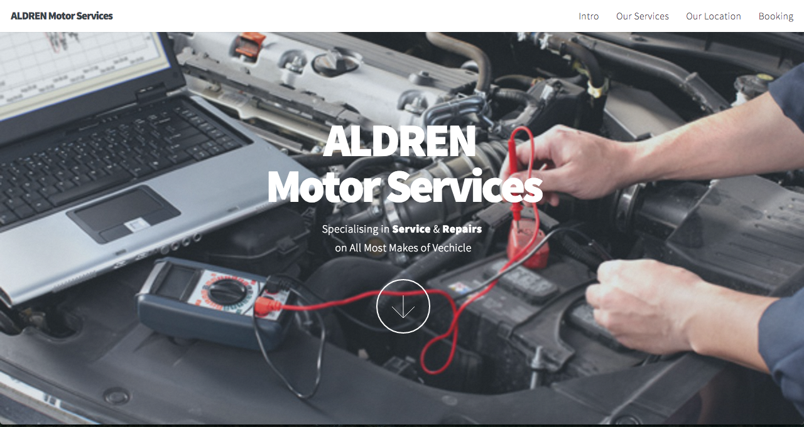

# Aldren

This is the repo for Aldren Motor Services website.

### Tools Used:

**Skel** - A lightweight framework for building responsive sites and web apps. [GitHub](http://skel.io/)

**Scrolly** - Super simple and easy to use parallax plugin for jQuery [GitHub](https://github.com/Victa/scrolly) [Example](http://lab.victorcoulon.fr/javascript/scrolly/)

**jquery.scrollex** - Nifty scroll events for jQuery [GitHub](https://github.com/n33/jquery.scrollex)

**jquery.poptrox** - A lightbox gallery plugin for jQuery [GitHub](https://github.com/n33/jquery.poptrox)

